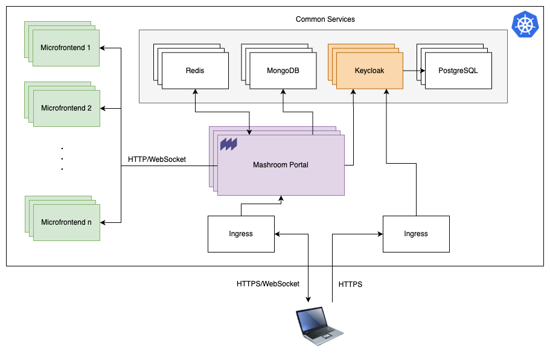

# Creating a Microfrontend Platform with Mashroom Portal on Kubernetes

This document describes a production ready concept for a Microfrontend platform based
on [Mashroom Portal](https://mashroom-server.com) and [Kubernetes](https://kubernetes.io).

This repo contains scripts to set up the complete platform within minutes on [k3d](https://k3d.io).
But it can of course be deployed on every Kubernetes cluster similarly.

## The platform

### Features

The platform allows it to deploy each Microfrontend separately and to make it **automatically** available in the Portal,
so it can be placed on arbitrary pages.

Highlights:

 * Automatic discovery of newly deployed (Mashroom Portal compliant) Microfrontends
 * High Availability: All building blocks are stateless and can be scaled horizontally
 * Support for server side messaging: The Microfrontends can not only use the *MessageBus* to exchange messages on the same page
   but also with other users and 3rd party systems
 * Extensive metrics exposed in Prometheus format

### Building blocks

The outlined platform consists of:

 * A *Kubernetes* cluster
 * A bunch of common services that can be used by the Portal and the Microfrontends
     * [Keycloak](https://www.keycloak.org) Identity Provider for authentication and authorization
     * A database for Keycloak, e.g [PostgreSQL](https://www.postgresql.org)
     * [Redis](https://redis.io) cluster for Portal session storage
     * [MongoDB](https://www.mongodb.com) for the Portal configuration
 * A [Mashroom Portal](https://mashroom-server.com) for the Microfrontend integration with the following plugins:
     * @mashroom/mashroom-storage-provider-mongodb
     * @mashroom/mashroom-memory-cache (Memory cache for the MongoDB storage)
     * @mashroom/mashroom-memory-cache-provider-redis
     * @mashroom/mashroom-security-provider-openid-connect
     * @mashroom/mashroom-portal-remote-app-registry-k8s (Microfrontend discovery)
     * @mashroom/mashroom-session-provider-redis
     * @mashroom/mashroom-websocket
     * @mashroom/mashroom-messaging
     * @mashroom/mashroom-messaging-external-provider-redis
     * @mashroom/mashroom-monitoring-metrics-collector
     * @mashroom/mashroom-monitoring-prometheus-exporter
 * A bunch *Mashroom Portal* compliant Microfrontends

## Setup Guides

 * [k3d Setup](SETUP_K3D.md)
 * [Manual Setup Guide for Kubernetes](SETUP_K8S_MANUAL.md)
 * [Local Development Setup](SETUP_LOCAL_DEV.md)

## Professional Support

If you need help to set up your fancy Microfrontend Platform
contact us for [professional support](mailto:mashroom@nonblocking.at)!

## Notes

 * The k3d demo setup is not production ready. Most notably the IDP (Keycloak) runs in dev mode with TLS disabled.
   Furthermore, most common services (like MongoDB) are not replicated and not highly available
 * You should put every Microfrontend in a separate repo and use different namespaces per team.
   The Portal will automatically pick up new namespaces if they have specific labels (see *Mashroom Portal Remote App Kubernetes Background Job* config).
 * To build a Microfrontend platform outlined here you can use the same tools and approaches as for a Microservice platform.
   For example [Argo CD](https://argoproj.github.io/cd), [Spinnaker](https://www.spinnaker.io) or [JenkinsX](https://jenkins-x.io).
 * You should also deploy [Prometheus](https://prometheus.io/) and [Grafana](https://grafana.com/) for monitoring the Portal.
   [Here](https://github.com/nonblocking/mashroom/blob/master/packages/plugin-packages/mashroom-monitoring-prometheus-exporter/test/grafana-test/grafana/provisioning/dashboards/Mashroom%20Dashboard.json) you can find an example Dashboard configuration.
   And [this article](https://medium.com/mashroom-server/connecting-mashroom-to-the-grafana-observability-stack-4cd6a2520515) describes how to add tracing in the Portal.
 * Checkout this article how to debug Microfrontend running on K8S locally with Telepresence:
   https://medium.com/mashroom-server/debug-microfrontends-on-a-kubernetes-cluster-with-telepresence-d709333ee1b7
 * Our [Youtube Channel](https://www.youtube.com/@mashroomserver) contains videos that cover setup and deployment of Mashroom Portal

