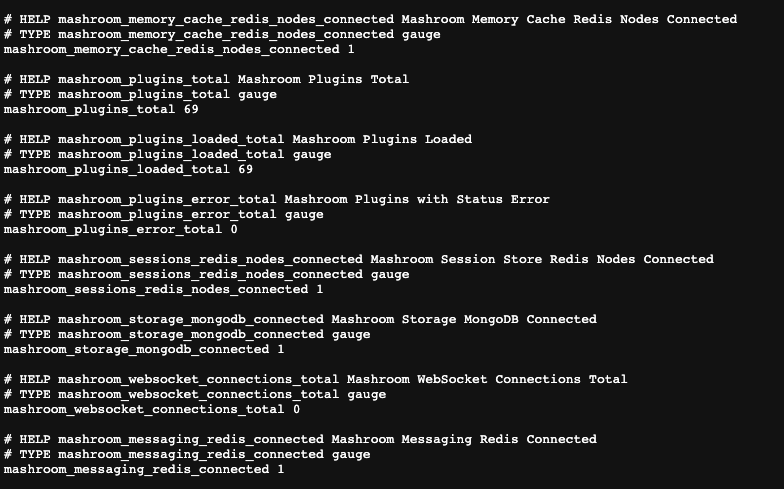

# Setup on K3D

This describes how to setup such a platform with [k3d](https://k3d.io) for local testing and development.

If you use the _Google Kubernetes Engine_ use the [GCP Setup Guide](SETUP_GCP.md) which is much simpler.

If you use any other technology to run a k8s cluster please follow the [Setup K8S manually Guide](SETUP_K8S_MANUAL.md).

## Requirements

- Current user has access to docker.sock (sudo setfacl --modify user:<user name or ID>:rw /var/run/docker.sock)

### Installed

- [docker](https://www.docker.com)
- [k3d](https://k3d.io)
- [kubectl](https://kubernetes.io/de/docs/tasks/tools/install-kubectl/)
- [helm](https://helm.sh/)
- [envsub](https://github.com/danday74/envsub)

## Create a new cluster and setup the Microfrontend platform

    ./k3d/setup-mashroom-cluster.sh

This creates a new Kubernetes cluster, sets up the common services and deploys the *Mashroom Portal*
with two demo Microfrontends.

After the script finishes the Portal should now be available under http://localhost:30082,
and you should be able to add *Microfrontend Demo1* and *Microfrontend Demo2* to any page.

## Re-Deploy the Mashroom Portal

    ./portal/kubernetes/k3d/docker-build-and-push.sh
    kubectl rollout restart deployment mashroom-portal

Or delete the current deployment and run

    ./portal/kubernetes/k3d/deploy.sh

## Re-Deploy the Microfrontends

    ./microfrontend-demo1/kubernetes/k3d/docker-build-and-push.sh
     kubectl rollout restart deployment microfrontend-demo1

    ./microfrontend-demo2/kubernetes/k3d/docker-build-and-push.sh
     kubectl rollout restart deployment microfrontend-demo2

Or delete the current deployments and run

    ./microfrontend-demo1/kubernetes/k3d/deploy.sh
    ./microfrontend-demo2/kubernetes/k3d/deploy.sh

## Check if the platform is up and running

- Install [Lens](https://k8slens.dev/) or a similar tool, connect to the cluster and check the workloads:
  
- Enter http://localhost:30082 in your browser
- Login as admin user
- On an arbitrary page click _Add App_, search for _Microfrontend Demo1_ and add via Drag'n'Drop:
  
- You can check the registered Microfrontends on http://localhost:30082/portal-remote-app-registry-kubernetes
  
- To check the messaging add the _Mashroom Portal Demo Remote Messaging App_ (as admin) to a page, open the same page as
  another user (john/john) and send as _john_ a message to _user/admin/test_ - it should appear in the other users _Demo
  Remote Messaging App_
- You can also check if all portal replicas are subscribed to the message broker. The RabbitMQ Admin UI can be made
  locally available with:

       kubectl port-forward --namespace default svc/rabbitmq-amqp10 15672:15672

  After opening http://localhost:15672 and logging in you should be able to see the bindings on the _amqp.topic_
  exchange:
  

- The Prometheus metrics will be available on http://localhost:30082/metrics. If you open this URL you should see
  something like this:
  

## Cleanup

    k3d cluster stop mashroom-cluster
    k3d cluster delete mashroom-cluster

## Troubleshooting

### Redeploy Portal or Microfrontends

 - Build and publish the new image
 - Run

    kubectl rollout restart deployment <deployment>

### Scripts cannot be executed

    You might forgot to give your script the permission to run
    chmod a+x <path to sciript>

### Check from the inside

    To quickly create a busybox image and use the bash run:
    kubectl run -i --tty --rm debug --image=progrium/busybox --restart=Never -- sh
    install packages with opkg-install, e.g. opkg-install curl
